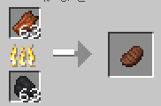
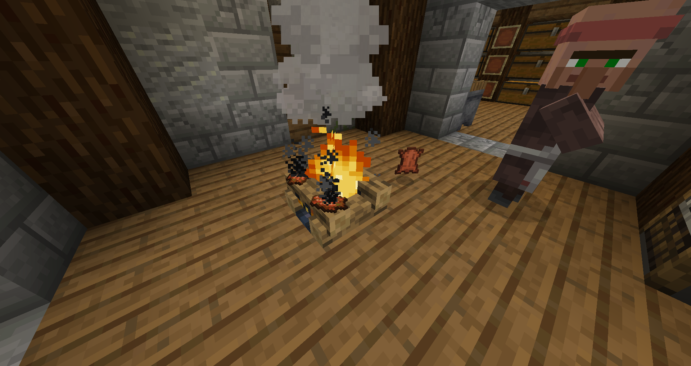

# Zombeef
This datapack is used to obtain cooked beef and leather from rotten flesh.

## Recipes
### Rotten flesh -> Cooked beef


### Rotten flesh -> Leather


## Installation

Download from [Latest Release](https://github.com/sharo-jef/zombeef/releases/latest/) or `git clone` in your `datapacks` directory as follows.

```
git clone git@github.com:sharo-jef/zombeef.git
```
